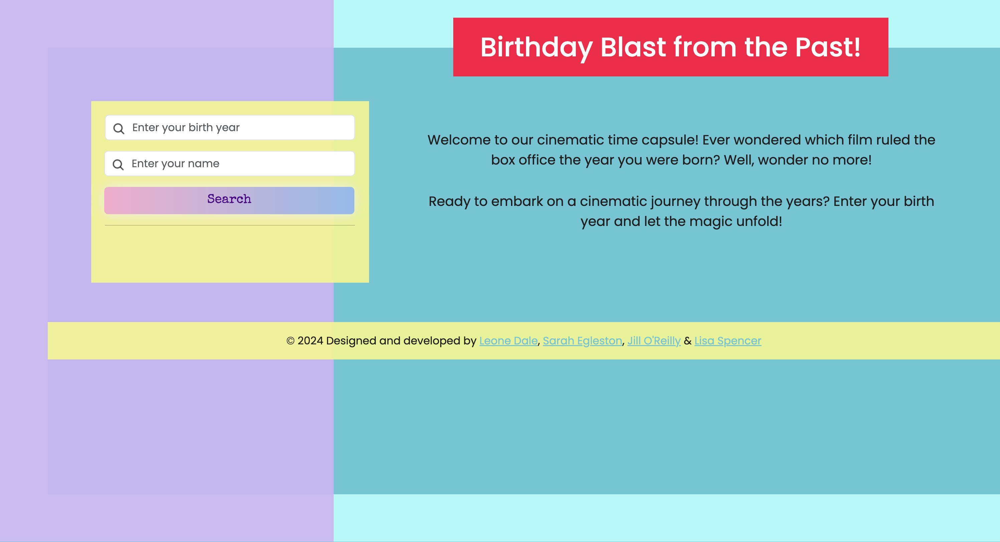

# birthday-blast-from-the-past

## Description

Welcome to Birthday Blast from the Past! 🎬✨

Birthday Blast from the Past is a collaborative web application project, brought to you by Lisa Spencer, Jill O'Reilly, Sarah Egleston, and Leone Dale. Together, we've crafted an application that combines personal information with movie data to create a nostalgic journey through time.

## How it works

- [Deployed Link](https://jilloreilly.github.io/birthday-blast-from-the-past)
- [GitHub Link](https://github.com/jilloreilly/birthday-blast-from-the-past)

1. User Input: Provide your name and year of birth using the user-friendly form on the webpage.

2. Movie Data Retrieval: Uses the TheMovieDB API to fetch information about the top movie from the specified birth year. The retrieved data includes the movie's name, release date, and poster.

3. Detailed Movie Information: A second API call is made to TheMovieDB API to obtain additional details about the top movie, such as its runtime, genre, and tagline.

4. YouTube Trailer Integration: Using the obtained movie data, the application seamlessly embeds a YouTube trailer for the selected movie, allowing you to relive the cinematic experience.

5. Carousel of Movie Memories: Lastly to enhance the nostalgic trip, a Bootstrap carousel showcases and additonal three more top movies from the birth year.

## Technologies Used

- HTML5: Structuring the webpage.
- CSS3: Styling the elements for an appealing user interface.
- JavaScript (with jQuery): Handling dynamic content, form submission, and API calls.
- Bootstrap: Creating a responsive and visually appealing carousel.
- TheMovieDB API: Fetching movie data.
- YouTube Data API: Integrating YouTube trailers.

## Credits

- Chris Katz - TA
- [Bootstrap](https://getbootstrap.com/docs/5.3/getting-started/introduction/)
- [jQuery](https://api.jquery.com/)
- [jQuery UI](https://jqueryui.com/)
- [YouTube API](https://developers.google.com/youtube/v3)
- [MovieDB API](https://developer.themoviedb.org/)
- [Icons/Favicon](https://icons8.com/icons)
- [Fetch/Catch API, Odewahn GitHub](https://gist.github.com/odewahn/5a5eeb23279eed6a80d7798fdb47fe91)
- [Gif](https://new.express.adobe.com/tools/convert-to-gif)

## License

MIT License

Copyright (c) 2024 Jill O'Reilly

Permission is hereby granted, free of charge, to any person obtaining a copy
of this software and associated documentation files (the "Software"), to deal
in the Software without restriction, including without limitation the rights
to use, copy, modify, merge, publish, distribute, sublicense, and/or sell
copies of the Software, and to permit persons to whom the Software is
furnished to do so, subject to the following conditions:

The above copyright notice and this permission notice shall be included in all
copies or substantial portions of the Software.

THE SOFTWARE IS PROVIDED "AS IS", WITHOUT WARRANTY OF ANY KIND, EXPRESS OR
IMPLIED, INCLUDING BUT NOT LIMITED TO THE WARRANTIES OF MERCHANTABILITY,
FITNESS FOR A PARTICULAR PURPOSE AND NONINFRINGEMENT. IN NO EVENT SHALL THE
AUTHORS OR COPYRIGHT HOLDERS BE LIABLE FOR ANY CLAIM, DAMAGES OR OTHER
LIABILITY, WHETHER IN AN ACTION OF CONTRACT, TORT OR OTHERWISE, ARISING FROM,
OUT OF OR IN CONNECTION WITH THE SOFTWARE OR THE USE OR OTHER DEALINGS IN THE
SOFTWARE.
